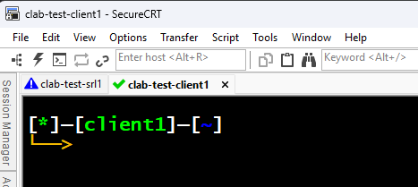
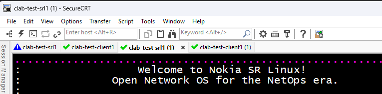
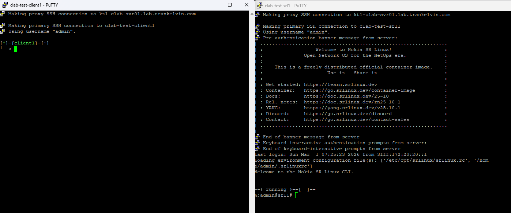
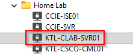
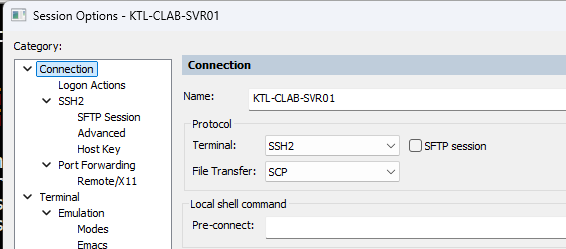
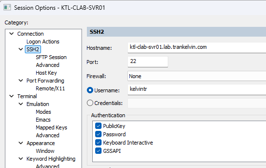
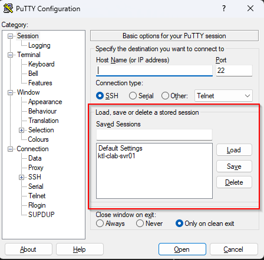
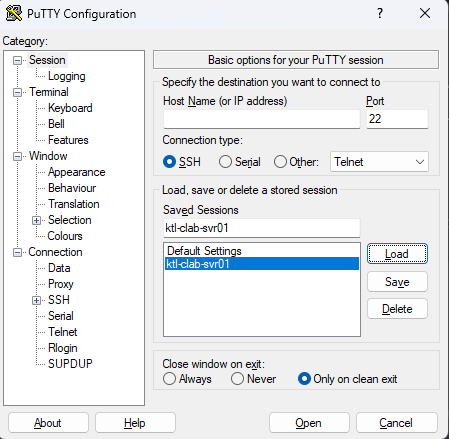
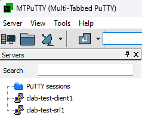
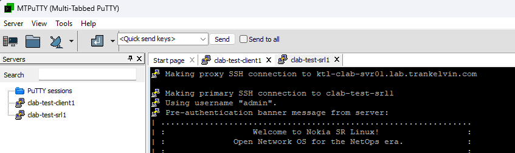

# Installation and Usage Documentation

## Table of Contents
<!-- TOC -->
* [Installation and Usage Documentation](#installation-and-usage-documentation)
  * [Table of Contents](#table-of-contents)
  * [Installation](#installation)
  * [Usage](#usage)
    * [Examples](#examples)
      * [Example 1: API + SecureCRT, Manual Commands](#example-1-api--securecrt-manual-commands)
      * [Example 2: API + SecureCRT, Quick Command](#example-2-api--securecrt-quick-command)
      * [Example 3: Inspect + PuTTY, Manual Commands](#example-3-inspect--putty-manual-commands)
    * [Command Reference](#command-reference)
      * [Manual Command: API Retrieval](#manual-command-api-retrieval)
      * [Manual Command: "clab inspect" Output](#manual-command-clab-inspect-output)
      * [Manual Command: Port Customization (Optional)](#manual-command-port-customization-optional)
      * [Manual Command: Launching with SecureCRT](#manual-command-launching-with-securecrt)
      * [Manual Command: Launching with PuTTY](#manual-command-launching-with-putty)
      * [Manual Command: Launching with MTPuTTY](#manual-command-launching-with-mtputty)
      * [Manual Command: Launching with native OpenSSH](#manual-command-launching-with-native-openssh)
      * [Shortcut/Quick Command](#shortcutquick-command)
    * [File Reference](#file-reference)
      * [Credentials File](#credentials-file)
      * [Configuration File (Environment Variables)](#configuration-file-environment-variables)
      * [Custom Ports](#custom-ports)
<!-- TOC -->

---

## Installation

There are a few requirements for installing and using the clab terminal launcher:
* Containerlab must be installed (duh, haha) - tested on the latest 0.73 release
  * It'll likely work on prior versions too, I'm not aware of any breaking API changes
* Python 3.12 or later must be installed
* Your terminal emulator of choice must be installed

Before installing the utility, **it's HIGHLY RECOMMENDED** that you first create a dedicated Python virtual environment 
for it using whichever method you prefer (e.g., Astral's uv, the native venv module, etc.) Using uv (`uv venv <name>`) 
is personally my favorite method. This will allow you to isolate the terminal launcher installation and its dependencies 
from other Python packages on your system.

From there, after activating your virtual environment (check out Python's documentation for more details on how to do this using
your specific OS/platform), you just need to run `pip install clab-terminal-launcher`. That's it!

Here's an example of doing it on my Linux system:

(**NOTE**: as shown, uv users need to run `uv pip install` instead of plain `pip install` - not a big deal!)
```bash
kelvintr@KTP-WNDS-WK01:~/test$ uv venv clab-term-launcher-example
Using CPython 3.12.3 interpreter at: /usr/bin/python3
Creating virtual environment at: clab-term-launcher-example
Activate with: source clab-term-launcher-example/bin/activate
kelvintr@KTP-WNDS-WK01:~/test$ source clab-term-launcher-example/bin/activate
(clab-term-launcher-example) kelvintr@KTP-WNDS-WK01:~/test$ uv pip install clab-terminal-launcher
Using Python 3.12.3 environment at: clab-term-launcher-example
Resolved 10 packages in 61ms
Prepared 1 package in 8ms
Installed 10 packages in 5ms
 + certifi==2026.2.25
 + charset-normalizer==3.4.4
 + clab-terminal-launcher==0.1.0
 + click==8.3.1
 + dotenv==0.9.9
 + idna==3.11
 + python-dotenv==1.2.1
 + pyyaml==6.0.3
 + requests==2.32.5
 + urllib3==2.6.3
(clab-term-launcher-example) kelvintr@KTP-WNDS-WK01:~/test$ clab-terminal-launcher
Usage: clab-terminal-launcher [OPTIONS] COMMAND [ARGS]...

  Containerlab (clab) Terminal Launcher -- A solution to take the hassle out
  of launching sessions and connecting to virtualized network devices running
  in Containerlab

Options:
  --help  Show this message and exit.

Commands:
  launch     Automatically launch sessions to connect to lab devices
  node-data  Process data for running Containerlab nodes
  quick      Quickly perform all commands required to launch sessions to...
```

## Usage

Two things can be true at once. For example, the Sun is bright and sushi is also objectively the best food on the planet!
Oh, and while we're at it, this utility is simultaneously extremely customizable **AND** also extremely easy to use.

There's a lot of commands, but that's only because there's a lot of intended pathways you can take to use this utility.
Before you go on, there's four decisions you need to make:

1. **Retrieval method** - how do you want this utility to retrieve data about running nodes in Containerlab? You can either enable the Containerlab API and allow the utility to query it or provide the utility a file containing the output from `clab inspect`
2. **Launch method** - what terminal emulator do you want to use? How do you want this utility to launch the sessions? You can choose from any of the supported options listed in the Features section in the [README file](/README.md).
3. **Custom ports or default ports?** - have you defined custom port mappings (e.g., for SSH) for your lab devices in your Containerlab topology definition?
4. **Manual commands or shortcut command?** - do you want to run each of the required commands to execute the decisions you made above (good for one-off cases) or do you want to build a configuration file containing the settings for all of those decisions that you can easily reuse for multiple subsequent uses (even across different labs)?

We'll outline the steps to take for all of the possible answers to these four questions/decisions. *You don't need to
look at all of them, unless you want to!* Feel free to jump to the sections that are relevant to the decisions that
you made.

### Examples

You'll find the example files (e.g., credentials files, JSON input/output, .env/config files, etc.) in the 
[docs/examples subdirectory of this repository](examples/).

Refer to the command reference/documentation sections below for more details about how these commands operate.

#### Example 1: API + SecureCRT, Manual Commands

In this example, we are using the following parameters:

* **API host:** ktl-clab-svr01.lab.trankelvin.com
* **API username:** kelvintr
* **API password:** Provided interactively
* * **Labs to look for:** All running labs
* **Running lab/node data file:** labs.json
* **Credentials file:** creds.yml
* **SecureCRT executable:** securecrt.exe (necessary in my case - `securecrt` doesn't work on WSL, it has to be `securecrt.exe` for WSL to recognize it as a Windows executable and launch in the Windows environment)
* **Jumphost SecureCRT session:** Home Lab\KTL-CLAB-SVR01

```
(clab-term-launcher-example) kelvintr@KTP-WNDS-WK01:~/test$ clab-terminal-launcher node-data retrieve-from-api -h ktl-clab-svr01.lab.trankelvin.com -u kelvintr -o labs.json
Authenticating to the Containerlab API at host ktl-clab-svr01.lab.trankelvin.com...
Enter your Containerlab host password:
Retrieving running nodes for all labs...
Labs found: test
Output successfully written to labs.json
(clab-term-launcher-example) kelvintr@KTP-WNDS-WK01:~/test$ clab-terminal-launcher launch securecrt -i labs.json -c creds.yml -e securecrt.exe -s "Home Lab\KTL-CLAB-SVR01"
Preparing to launch SecureCRT sessions for 2 devices from labs.json...
Using jumphost: Home Lab\KTL-CLAB-SVR01
Launching SSH session to device clab-test-client1 using address clab-test-client1, port 22, username admin, password multit00l
Launching SSH session to device clab-test-srl1 using address clab-test-srl1, port 22, username admin, password NokiaSrl1!
```


 
#### Example 2: API + SecureCRT, Quick Command

In this example, we are using the same parameters as example 1, except contained inside of a 
[configuration file](examples/config.env) called config.env. Since this is the default file name that the quick command 
is looking for, we don't need to specify any flags.

```
(clab-term-launcher-example) kelvintr@KTP-WNDS-WK01:~/test$ clab-terminal-launcher quick
Found values for: username, outputfile, password, clabHost
Authenticating to the Containerlab API at host ktl-clab-svr01.lab.trankelvin.com...
Retrieving running nodes for all labs...
Labs found: test
Output successfully written to labs.json
Found values for: creds, inputfile, jumphost, executable
Preparing to launch SecureCRT sessions for 2 devices from labs.json...
Using jumphost: Home Lab\KTL-CLAB-SVR01
Launching SSH session to device clab-test-client1 using address clab-test-client1, port 22, username admin, password multit00l
Launching SSH session to device clab-test-srl1 using address clab-test-srl1, port 22, username admin, password NokiaSrl1!
```



#### Example 3: Inspect + PuTTY, Manual Commands

In this example, we are using the following parameters:

* **Host specified:** ktl-clab-svr01.lab.trankelvin.com (not strictly necessary, unless any of your lab devices have custom port numbers)
* **Inspect command used to generate output**: `clab inspect --all --details`
* **JSON file containing inspect output**: inspectoutput.json
* **Running lab/node data file:** inspect-labs.json
* **Credentials file:** creds.yml
* **PuTTY executable:** putty.exe (necessary in my case - `putty` doesn't work on WSL, it has to be `putty.exe` for WSL to recognize it as a Windows executable and launch in the Windows environment)
* **Jumphost PuTTY session:** ktl-clab-svr01

```
(clab-term-launcher-example) kelvintr@KTP-WNDS-WK01:~/test$ clab-terminal-launcher node-data parse-inspect-output -h ktl-clab-svr01.lab.trankelvin.com -i inspectoutput.json -o inspect-labs.json
Parsing output for lab test...
Output successfully written to inspect-labs.json
(clab-term-launcher-example) kelvintr@KTP-WNDS-WK01:~/test$ clab-terminal-launcher launch putty -c creds.yml -i inspect-labs.json -e putty.exe -s ktl-clab-svr01
Preparing to launch PuTTY sessions for 2 devices from inspect-labs.json...
Using jumphost: ktl-clab-svr01
Launching SSH session to device clab-test-client1 using address clab-test-client1, port 22, username admin, password multit00l
Launching SSH session to device clab-test-srl1 using address clab-test-srl1, port 22, username admin, password NokiaSrl1!
```



### Command Reference

The command structure of the utility is `clab-terminal-launcher <commands> <options>`. For any command, the `--help`
option is available to show helpful descriptions of the command and its associated options.

For all of the following sections, the following table of base/root-level commands will be helpful to keep in mind:

| Command   | Purpose                                                                                                                                                                         |
|-----------|---------------------------------------------------------------------------------------------------------------------------------------------------------------------------------|
| launch    | Contains manual commands to initiate/control automatic launching of sessions/connections to running lab devices                                                                 |
| node-data | Contains manual commands to initiate/control data retrieval/manipulation for running nodes in Containerlab                                                                      |
| quick     | Automatic command to run all commands required to launch sessions/connections to running lab devices, based on the behavior/settings defined in the provided configuration file |           

Note that `launch` and `node-data` are not runnable commands in and of themselves, but rather just groupings for the 
subcommands that are actually runnable.

**launch subcommands**

| Command        | Purpose                                                                                                   |
|----------------|-----------------------------------------------------------------------------------------------------------|
| securecrt      | Use SecureCRT to automatically launch sessions/connections to running lab devices                         |
| putty          | Use PuTTY to automatically launch sessions/connections to running lab devices                             |
| mtputty        | Create sessions in the MTPuTTY configuration to be used when launching connections to running lab devices |
| native-openssh | Use a native terminal + OpenSSH to automatically launch sessions/connections to running lab devices       |

**node-data subcommands**

| Command              | Purpose                                                                                                         |
|----------------------|-----------------------------------------------------------------------------------------------------------------|
| retrieve-from-api    | Automatically retrieve running lab devices from the Containerlab REST API                                       |
| parse-inspect-output | Process `clab inspect` output to find details about running lab devices                                         |
| inject-custom-ports  | Inject customized ports into the data file used by the utility containing information about running lab devices |

#### Manual Command: API Retrieval

This is the preferred and easiest way to get data about the running nodes in Containerlab.
This relies on the `clab-terminal-launcher node-data retrieve-from-api` command. Using this command, the utility will
query the REST API of the Containerlab host and automatically retrieve, parse, and format the data into the required
structure for the other functions in the utility (e.g., `inject-custom-ports` and `launch` subcommands) to utilize.

In order for this command to work, the Containerlab API must first be started and accessible over HTTP. 
To confirm this, run the `clab tools api-server status` command. Your output should look something like this:

```
kelvintr@ktl-clab-svr01:~/labs$ clab tools api-server status
╭─────────────────┬─────────┬───────────┬──────┬──────────┬─────────┬──────────╮
│ NAME            │ STATUS  │ HOST      │ PORT │ LABS DIR │ RUNTIME │ OWNER    │
├─────────────────┼─────────┼───────────┼──────┼──────────┼─────────┼──────────┤
│ clab-api-server │ running │ localhost │ 8080 │ ~/.clab  │ docker  │ kelvintr │
╰─────────────────┴─────────┴───────────┴──────┴──────────┴─────────┴──────────╯
```

If it's not started, run the `clab tools api-server start` command to start it. 

Another thing you'll need is the credentials for the API server. By default, the API server relies on the Linux
credentials of users in the `clab_admins` or `clab_api` groups. **Since these are real Linux credentials on the
Containerlab host, it's recommended that you provide the credentials (at least the password) to the utility in 
a secure form (i.e., via interactive authentication or an environment variable).** 

Refer to the documentation for the Containerlab API server for more details regarding the behavior of the API.

The following parameters are available:

| Parameter (Long & Short Names) | Required | Default (if applicable)                        | Purpose                                                                                                                                                                                                                                                                                                                                                                                                                                                                                                                                                                               |
|--------------------------------|----------|------------------------------------------------|---------------------------------------------------------------------------------------------------------------------------------------------------------------------------------------------------------------------------------------------------------------------------------------------------------------------------------------------------------------------------------------------------------------------------------------------------------------------------------------------------------------------------------------------------------------------------------------|
| --envfile, -e                  | No       | N/A - looks in native OS environment variables | Used to specify a [.env formatted file](#configuration-file-environment-variables) containing the "**CLABPASS**" environment variable to feed the API password for Containerlab to the utiility; if specified, overrides the default behavior of looking for the aforementioned environment variable in the native environment of the OS                                                                                                                                                                                                                                              |
| --host, -h                     | No       | localhost                                      | If the Containerlab host is remote (i.e., not localhost), must be used to specify the IP address/DNS name of the Containerlab host to be used for the API connection, as well as during the connection to the lab devices if the utility is configured to connect via the real Containerlab host address)                                                                                                                                                                                                                                                                             |
| --labs, -l                     | No       | N/A - looks for all running labs               | Specify a filter to restrict the API query made to Containerlab by the utility to specific labs; use a comma-separated format for multiple labs (e.g., `--labs lab1,lab2`)                                                                                                                                                                                                                                                                                                                                                                                                            |
| --outputfile, -o               | Yes      | N/A                                            | Used to specify the path/name of the file that will be used to store the rendered/parsed running node data generated by this command and used by other commands in the utility (examples listed above)                                                                                                                                                                                                                                                                                                                                                                                |                                                                                           |
| --username, -u                 | Yes      | N/A                                            | Used to specify the username to authenticate to the Containerlab API                                                                                                                                                                                                                                                                                                                                                                                                                                                                                                                  |
| --password, -p                 | No       | N/A - seeks other methods to obtain password   | **INSECURE!!! INCLUDED FOR EASE OF USE ONLY!!! ONLY USE IF YOU WOULDN'T CARE THAT YOUR NEIGHBOR 6 DOORS DOWN LEARNED THIS PASSWORD**<br><br>Used to specify the password to authenticate to the Containerlab API. If specified, it will take precedence over all other methods for obtaining the password (e.g., environment variable). If not specified, the utility will look for the "**CLABPASS**" environment variable next. If that is not found, as a last resort, the utility will interactively ask you to input the password via the console before the connection proceeds |

#### Manual Command: "clab inspect" Output

As an alternative to the API method, if enabling and accessing the Containerlab API from your client machine is 
untenable (e.g., due to firewall/security restrictions for HTTP traffic), you can also feed the utility a text file
containing the output from `clab inspect`, which is included in the command set in the terminal of the actual 
Containerlab host itself.

The manual command for this method is `clab-terminal-launcher node-data parse-inspect-output`.

To use this method, you must first obtain the `clab inspect` output by running any one of the following variations of
this command on your Containerlab host:
* **Show all deployed labs** - `clab inspect --all --details`
* **Show all deployed labs in a particular path (e.g., a directory)** - `clab inspect -t <path> --details`
* **Show only one deployed lab specified by name** - `clab inspect --name <lab name> --details`

It is worth noting that `--details` is **VERY IMPORTANT**, no matter which variation of the command you use, as it
tells the `clab inspect` command to format the output using JSON, as opposed to the normal human-readable format. This
is what allows the utility to process the data.

From there, you can either:
* Redirect the data into a file (e.g., `clab inspect --all --details > labs.json`) and copy
that file to the client machine running this utility
* Copy the command output from the terminal (i.e., stdout) to a file on your client machine running the utility - likely faster if you are connected to the terminal of a remote Containerlab host via SSH

You'll need to provide the path/name of this file to the utility using the `--inputfile/-i` options, as discussed in the table below.

The following parameters are available:

| Parameter (Long + Short Names) | Required | Default (if applicable) | Purpose                                                                                                                                                                                                                                                                |
|--------------------------------|----------|-------------------------|------------------------------------------------------------------------------------------------------------------------------------------------------------------------------------------------------------------------------------------------------------------------|
| --host, -h                     | No       | localhost               | If the Containerlab host is remote (i.e., not localhost), must be used to specify the IP address/DNS name of the Containerlab host to be used during the connection to the lab devices if the utility is configured to connect via the real Containerlab host address) |
| --inputfile, -i                | Yes      | N/A                     | Used to specify the JSON file containing the `clab inspect` output required for the command to operate, as discussed above                                                                                                                                             |
| --outputfile, -o               | Yes      | N/A                     | Used to specify the path/name of the file that will be used to store the rendered/parsed running node data generated by this command and used by other commands in the utility (examples listed above)                                                                 |

#### Manual Command: Port Customization (Optional)

If your Containerlab topology definition file has a custom port mapping configured that must be observed when forming
the connection/session to the lab device, the `clab-terminal-launcher node-data inject-custom-ports` must be used
**AFTER** running the manual **retrieval** command for your respective method (e.g., API/inspect output), but **BEFORE**
running the manual **launch** command for your respective method (e.g., SecureCRT).

An example of a Containerlab topology definition file with this setting is included, for your reference:

```yaml
topology:
  nodes:
    srl1:
      kind: nokia_srlinux
      type: ixrd1
      image: ghcr.io/nokia/srlinux:latest
      ports:
        - 2500:22
```

As shown in the parameters table below, a YAML file containing the custom ports for the running lab nodes/devices must
be provided. The format for creating this YAML file is illustrated in the [Custom Ports](#custom-ports) section of the
file reference.

**IMPORTANT NOTES**:
* In your YAML file, you only need to include lab devices/nodes that are actually using custom port numbers
* **If you are using the default ports (e.g., 22 for SSH), you do NOT need to run this command.**
* The `--method/-m` flag of the launch commands does NOT have any effect on lab devices with customized port numbers. This is because a custom port number implies that the Containerlab host's hostname/IP address should be used as the address for the connection, rather than the lab device's management IP address/DNS name. The utility handles this automatically when it sees a custom port number, without respect to the value of the method flag.
  * With that said, the value of the `--method/-m` flag **WILL** still apply to other lab devices that are using default port numbers

The following parameters are available:

| Parameter (Long + Short Names) | Required | Default (if applicable) | Purpose                                                                                                                                                                                                                                                                                        |
|--------------------------------|----------|-------------------------|------------------------------------------------------------------------------------------------------------------------------------------------------------------------------------------------------------------------------------------------------------------------------------------------|
| --datafile, -d                 | Yes      | N/A                     | Specify the path/name of the **rendered** JSON file that was created by one of the retrieval methods in this utility (e.g., API/inspect output)                                                                                                                                                |
| --portfile, -p                 | Yes      | N/A                     | Specify the path/name of the YAML file created using the format described above that contains the custom port numbers for each node                                                                                                                                                            |
| --output, -o                   | No       | Same as datafile        | Specify the output path for the new rendered JSON file containing the custom port numbers for use by other commands (e.g., launch commands); only needed if you don't want to replace the original data file, the value for this option CANNOT be the same as the value of the datafile option |

#### Manual Command: Launching with SecureCRT

If you're using SecureCRT as your terminal emulator of choice, then the `clab-terminal-launcher launch securecrt` manual
command is exactly what you're looking for!

**If you are using a jumphost (e.g., your Containerlab host) to connect to your lab devices**, note that you will first
need to create a session inside of the SecureCRT session database and define all of the settings for the connection to
the jumphost prior to running this command. This is the session you will reference in the `--session/-s` option, as
discussed in the table below.

As an example of a jumphost session configured in SecureCRT, here's some images of how I have my Containerlab host
configured in SecureCRT. It's pretty much just a regular SSH session, as you'll see!





Consult the SecureCRT documentation for more information on SecureCRT settings (e.g., the settings to use for the
jumphost session.)

The following parameters are available:

| Parameter (Long + Short Names) | Required | Default (if applicable) | Purpose                                                                                                                                                                                                                                                                                                                                                                                                                                         |
|--------------------------------|----------|-------------------------|-------------------------------------------------------------------------------------------------------------------------------------------------------------------------------------------------------------------------------------------------------------------------------------------------------------------------------------------------------------------------------------------------------------------------------------------------|
| --creds, -c                    | Yes      | N/A                     | Specify the path/name of the YAML file containing the credentials (at minimum, username) used to connect to the lab devices created using the format described in the [Credentials File](#credentials-file) section of the [File Reference](#file-reference)                                                                                                                                                                                    |
| --inputfile, -i                | Yes      | N/A                     | Specify the path/name of the rendered JSON file containing the data about the running lab devices generated by other commands in this utility (e.g., node data retrieval commands)                                                                                                                                                                                                                                                              |
| --method, -m                   | No       | dns                     | Specify one of the following methods for connecting to the lab devices in Containerlab: "**dns**" (the DNS hostname of the lab device, e.g., clab-test-srl1), "**ipv4**" (the IPv4 address of the lab device, e.g., 172.20.20.1), or "**ipv6**" (the IPv6 address of the lab device, e.g., 3fff:172:20:20::2); **HAS NO EFFECT ON NODES WITH CUSTOM PORT NUMBERS, SEE [THIS SECTION](#manual-command-port-customization-optional) FOR WHY NOT** |
| --executable, -e               | No       | securecrt               | Specify the path/name of the executable for SecureCRT that will be used in the command to automatically launch sessions to lab devices; it's recommended that you confirm this is a valid command by typing it into the terminal/your shell and ensuring that SecureCRT launches                                                                                                                                                                |
| --session, -s                  | No       | N/A                     | If using the Containerlab host as a jumphost, specify the session name, as defined in SecureCRT, for the connection to the Containerlab host/jumphost.<br><br>Use the full path to the session, including the folders, as shown in the SecureCRT session manager. For example, if clab is a session stored in f2, which is a folder nested inside of an outer folder f1, you should provide **f1\f2\clab** as the value of this option          |

#### Manual Command: Launching with PuTTY

Automatically launching sessions using regular ol' PuTTY (i.e., one session per window) is as simple as using the
`clab-terminal-launcher launch putty` manual command.

**If you are using a jumphost (e.g., your Containerlab host) to connect to your lab devices**, note that you will first
need to create a session inside of the PuTTY session database and define all of the settings for the connection to
the jumphost prior to running this command. This is the session you will reference in the `--session/-s` option, as
discussed in the table below.

Take a look at the following images for an example of a jumphost session for the Containerlab host
at `ktl-clab-svr01.lab.trankelvin.com` in PuTTY.





Consult the PuTTY documentation for more information on PuTTY settings (e.g., the settings to use for the
jumphost session.)

The following parameters are available:

| Parameter (Long + Short Names) | Required | Default (if applicable) | Purpose                                                                                                                                                                                                                                                                                                                                                                                                                                           |
|--------------------------------|----------|-------------------------|---------------------------------------------------------------------------------------------------------------------------------------------------------------------------------------------------------------------------------------------------------------------------------------------------------------------------------------------------------------------------------------------------------------------------------------------------|
| --creds, -c                    | Yes      | N/A                     | Specify the path/name of the YAML file containing the credentials (at minimum, username) used to connect to the lab devices created using the format described in the [Credentials File](#credentials-file) section of the [File Reference](#file-reference)                                                                                                                                                                                      |
| --inputfile, -i                | Yes      | N/A                     | Specify the path/name of the rendered JSON file containing the data about the running lab devices generated by other commands in this utility (e.g., node data retrieval commands)                                                                                                                                                                                                                                                                |
| --method, -m                   | No       | dns                     | Specify one of the following methods for connecting to the lab devices in Containerlab: "**dns**" (the DNS hostname of the lab device, e.g., clab-test-srl1), "**ipv4**" (the IPv4 address of the lab device, e.g., 172.20.20.1), or "**ipv6**" (the IPv6 address of the lab device, e.g., 3fff:172:20:20::2); ; **HAS NO EFFECT ON NODES WITH CUSTOM PORT NUMBERS, SEE [THIS SECTION](#manual-command-port-customization-optional) FOR WHY NOT** |
| --executable, -e               | No       | putty                   | Specify the path/name of the executable for PuTTY that will be used in the command to automatically launch sessions to lab devices; it's recommended that you confirm this is a valid command by typing it into the terminal/your shell and ensuring that PuTTY launches                                                                                                                                                                          |
| --session, -s                  | No       | N/A                     | If using the Containerlab host as a jumphost, specify the session name, as defined in PuTTY, for the connection to the Containerlab host/jumphost.                                                                                                                                                                                                                                                                                                |

#### Manual Command: Launching with MTPuTTY

Are you on Windows? Do you like that PuTTY is free, but hate that it doesn't support multiple tabs/sessions in a single
window? If you said yes to all of these, consider using MTPuTTY! This utility supports MTPuTTY using the
`clab-terminal-launcher launch mtputty` command.

There is one caveat with the support for MTPuTTY in this utility: due to limitations with the available command-line
options for MTPuTTY, **there's no way for this utility to automatically launch sessions in MTPuTTY** (at least as far as
I'm aware). Instead, this utility directly modifies the session database in the MTPuTTY configuration to populate all
relevant information (e.g., lab node address, jumphost information, username, and password) in the session associated
with each lab device. 

> As a courtesy, each time the utility modifies the MTPuTTY configuration file, it will create a backup copy in the
> current directory named "mtputty_backup#.xml", where the number increases by 1 for each backup, just in case
> anything goes wrong!

This significantly reduces the manual labor required to create the sessions/connections to the
lab devices, but you will still need to manually open MTPuTTY after the utility has executed and launch the newly created
sessions from the list in the left-hand sidebar of the MTPuTTY GUI.

Note that, under the hood, MTPuTTY relies on the base PuTTY utility for establishing connections; MTPuTTY effectively
just wraps PuTTY in a tabbed GUI. As such, both need to be installed. Additionally, as is the case with the native
PuTTY option, if a jumphost is needed, the settings for the jumphost session must be defined and saved in the native 
PuTTY GUI as a PuTTY session. This is the PuTTY session that will be referenced in the `--session/-s` parameter, as
discussed in the table below.

Consult the PuTTY and MTPuTTY documentation for more information on available settings (e.g., the settings to use for the
jumphost session) and instructions for using the GUI to connect to sessions.




The following parameters are available:

| Parameter (Long + Short Names) | Required | Default (if applicable)       | Purpose                                                                                                                                                                                                                                                                                                                                                                                                                                           |
|--------------------------------|----------|-------------------------------|---------------------------------------------------------------------------------------------------------------------------------------------------------------------------------------------------------------------------------------------------------------------------------------------------------------------------------------------------------------------------------------------------------------------------------------------------|
| --creds, -c                    | Yes      | N/A                           | Specify the path/name of the YAML file containing the credentials (at minimum, username) used to connect to the lab devices created using the format described in the [Credentials File](#credentials-file) section of the [File Reference](#file-reference)                                                                                                                                                                                      |
| --inputfile, -i                | Yes      | N/A                           | Specify the path/name of the rendered JSON file containing the data about the running lab devices generated by other commands in this utility (e.g., node data retrieval commands)                                                                                                                                                                                                                                                                |
| --method, -m                   | No       | dns                           | Specify one of the following methods for connecting to the lab devices in Containerlab: "**dns**" (the DNS hostname of the lab device, e.g., clab-test-srl1), "**ipv4**" (the IPv4 address of the lab device, e.g., 172.20.20.1), or "**ipv6**" (the IPv6 address of the lab device, e.g., 3fff:172:20:20::2); ; **HAS NO EFFECT ON NODES WITH CUSTOM PORT NUMBERS, SEE [THIS SECTION](#manual-command-port-customization-optional) FOR WHY NOT** |
| --config, -f                   | No       | %appdata%\TTYPlus\mtputty.xml | Specify the path/name of the mtputty.xml file used as the MTPuTTY configuration file; the utility will create the sessions to the lab devices within this configuration file and save the new contents back to this file                                                                                                                                                                                                                          |
| --session, -s                  | No       | N/A                           | If using the Containerlab host as a jumphost, specify the session name, as defined in PuTTY, for the connection to the Containerlab host/jumphost.                                                                                                                                                                                                                                                                                                |

#### Manual Command: Launching with native OpenSSH

If you'd rather not use a separate terminal emulator and instead rely on the OpenSSH client (i.e., the `ssh` command)
and your native terminal of choice (e.g., Windows Terminal, macOS terminal, one of a million options for Linux 
terminals, etc.), that's fine! This utility supports that too, using the `clab-terminal-launcher launch native-openssh`
command.

Due to technical limitations in the capabilities of the OpenSSH client, password autofill is not available. **If
you choose to use this option, the required credentials option (discussed below) will only be used to find and autofill
the *username* when connecting to the lab devices.**

The following parameters are used:

| Parameter (Long + Short Names) | Required | Default (if applicable) | Purpose                                                                                                                                                                                                                                                                                                                                                                                                                                                                                                                |
|--------------------------------|----------|-------------------------|------------------------------------------------------------------------------------------------------------------------------------------------------------------------------------------------------------------------------------------------------------------------------------------------------------------------------------------------------------------------------------------------------------------------------------------------------------------------------------------------------------------------|
| --creds, -c                    | Yes      | N/A                     | Specify the path/name of the YAML file containing the credentials (at minimum, username) used to connect to the lab devices created using the format described in the [Credentials File](#credentials-file) section of the [File Reference](#file-reference)                                                                                                                                                                                                                                                           |
| --inputfile, -i                | Yes      | N/A                     | Specify the path/name of the rendered JSON file containing the data about the running lab devices generated by other commands in this utility (e.g., node data retrieval commands)                                                                                                                                                                                                                                                                                                                                     |
| --method, -m                   | No       | dns                     | Specify one of the following methods for connecting to the lab devices in Containerlab: "**dns**" (the DNS hostname of the lab device, e.g., clab-test-srl1), "**ipv4**" (the IPv4 address of the lab device, e.g., 172.20.20.1), or "**ipv6**" (the IPv6 address of the lab device, e.g., 3fff:172:20:20::2); ; **HAS NO EFFECT ON NODES WITH CUSTOM PORT NUMBERS, SEE [THIS SECTION](#manual-command-port-customization-optional) FOR WHY NOT**                                                                      |
| --executable, -e               | No       | ssh                     | Specify the path/name of the executable for OpenSSH (i.e., the command used to run the OpenSSH client) that will be used in the command to automatically launch sessions to lab devices; it's recommended that you confirm this is a valid command by typing it into the terminal/your shell and ensuring that the OpenSSH client runs                                                                                                                                                                                 |
| --session, -s                  | No       | N/A                     | If using the Containerlab host as a jumphost, specify the session name, as defined in your OpenSSH client config file, for the connection to the Containerlab host/jumphost. This will be used as the **-J** option in the SSH command                                                                                                                                                                                                                                                                                 |
| --terminal, -t                 | Yes      | N/A                     | Specify the full command for the executable of the terminal that is being used; the format `<terminal command> <ssh command>` is assumed, meaning that the SSH command for each node that is automatically generated by this utility will be placed after the terminal command you provide in this option; your terminal must support that format (most do!) for this option to work.<br><br>Note that your terminal command should include any flags needed, such as the ones to launch each SSH session in a new tab |

#### Shortcut/Quick Command

Do the other options sound like a bigger hassle than they're worth, with all of those manual commands? No worries!
This utility also has a shortcut command that is able to automatically trigger any of the other commands, based on
the settings you define in a configuration file. The command for this is `clab-terminal-launcher quick`. That's it!

As discussed below, there is one parameter to specify a configuration file, but if you use the default location
(`config.env` in the current directory), you don't need to specify any parameters/options at all!

Of course, the configuration file is the center of the world for this entire command. Reference the 
[Configuration File (Environment Variables)](#configuration-file-environment-variables) section in the
[File Reference](#file-reference) for more details about all of the available options and required format for this
configuration file.

Consult the OpenSSH client documentation [here](https://www.ssh.com/academy/ssh/config) and 
[here](https://man7.org/linux/man-pages/man5/ssh_config.5.html) for more information on OpenSSH client settings 
(e.g., the settings to use for the jumphost session.)

The following parameters are available:

| Parameter (Long + Short Names) | Required | Default (if applicable)                                             | Purpose                                                                                                                                      |
|--------------------------------|----------|---------------------------------------------------------------------|----------------------------------------------------------------------------------------------------------------------------------------------|
| --config, -c                   | No       | config.env (in the current directory; equivalent to "./config.env") | Specify the path/name of the .env formatted config file containing the settings that the quick command should use when executing the utility |

### File Reference

#### Credentials File

This is a YAML file that is essential for the utility to be able to locate the username and, optionally, password that
it should use to initiate a connection/session to the running devices in your Containerlab lab! This can be a bit of a
tricky thing to automate, since different nodes potentially use different credentials (except when they don't!), but
not to worry - the terminal launcher gives us a great definition syntax that makes it simple!

The basic structure for the YAML file is as follows, replacing each occurrence with `<filter #>`, `<username>`, and 
`<password>` with the appropriate value:

```yaml
<filter 1>:
  username: <username>
  password: <password; optional field>
<filter 2>:
  username: <username>
  password: <password; optional field>
<filter 3>:
  username: <username>
  password: <password; optional field>
default:
  username: <username>
  password: <password; optional field>
```

Each top-level key (denoted by `<filter #>` in the above example) represents an entry in the credentials file. The utility
will evaluate the entries in this file for each device to find a matching set of credentials that it can use to connect
to the device.

There are a couple of things to note about this file:

* Each device may only match on **one** entry (the most preferred, based on the order of precedence described below). When it matches on an entry for a device, the utility will not evaluate any other entries for that device. You can't get a username from one entry and a password from another, for example.
* Each device in the topology must be able to match at least one entry in your credentials file to get its username. Passwords are optional, but usernames are required. If the entry matched by a device doesn't contain a username field (or if the device doesn't match an entry at all), the utility will generate an error and exit.
  * In practice, this means it's recommended that each entry contain at least a username to avoid any issues.
  * If a password isn't associated with the entry a device matches on, password autofill will not be available for that session. It may still be available for other devices if a password is associated with them and the launch method chosen supports password autofill functionality.
* You can have as many filters as you want, and the order does not matter! Default can go at the top, bottom, or #5 in the list if you want!
* None of the filters are required - you can choose to use or not use any of them!

Filters, as the name suggests, allow us to define a specific scope to which the credentials apply. For each type of filter, 
note that you should use the value that appears for the respective field in the actual Containerlab topology definition data, 
as this is the data that the utility will be using to evaluate the filters. **Pro tip: Check out the output JSON file generated 
by the retrieval/node data commands (e.g., `retrieve-from-api`) if you want to make sure your filter lines up with the data 
the utility will actually be evaluating.**

Currently, these are the available filters (replace each occurrence of `<value>` with the respective value):

| Filter Syntax   | Purpose                                                                                                                                                                                                                                                                                                                                                                                                                    |
|-----------------|----------------------------------------------------------------------------------------------------------------------------------------------------------------------------------------------------------------------------------------------------------------------------------------------------------------------------------------------------------------------------------------------------------------------------|
| node=\<value\>  | Filter by the full/long name of a node (e.g., **clab-test-srl1** for a device called **srl1** in a lab called **test**) to specify credentials that only apply to one node                                                                                                                                                                                                                                                 |
| image=\<value\> | Filter by the image used by the node, as defined by the `image` setting for the device in the Containerlab topology definition (e.g., `ghcr.io/nokia/srlinux:latest` or `ghcr.io/srl-labs/network-multitool:latest`) to specify credentials that only apply to one specific image. Very useful in cases where multiple images of the same type of node (e.g., multiple Linux container images) have different credentials. |
| kind=\<value\>  | Filter by the kind/type of node, as defined in the `kind` setting for the device in the Containerlab topology definition (e.g., nokia_srlinux for Nokia SR Linux, cisco_c8000v for Cisco c8000v, etc.) to specify credentials that only apply to one kind of node                                                                                                                                                          |
| default         | Specifies credentials that apply to any device that doesn't match any of the more specific types of filters defined above                                                                                                                                                                                                                                                                                                  |

Suppose you have Nokia SR Linux devices that use admin/NokiaSrl1! as their username/password, but a whole host of other
devices that use admin/admin instead. The credentials file for this example is simple:

```yaml
kind=nokia_srlinux:
  username: admin
  password: NokiaSrl1!
default:
  username: admin
  password: admin
```

#### Configuration File (Environment Variables)

There are two scenarios where the utility needs to read variables from a configuration file. In both cases, the format
is the same:

```dotenv
KEY1=VALUE1
KEY2=VALUE2
KEY3=VALUE3
```

**NOTE:** Extra variables in the .env/config file are completely fine! They'll just be ignored, but they can hang out
there for as long as they want!

**API password for the `retrieve-from-api` command**

As an alternative to providing the password interactively when executing the command, as a flag, or as a native environment
variable in the OS, you can also provide it through a .env/config file. To accomplish this, create a file named anything
(e.g., clabpass.env) and populate it with these contents:

```dotenv
CLABPASS=<replace this with your Containerlab API password>
```

From there, feed this file into the command using the `--envfile/-e` option, as discussed in the 
[documentation for this command](#manual-command-api-retrieval).

**Configuration for the `clab-terminal-launcher quick` command**

When using the `quick` command, as opposed to the manual node-data/launch commands, you'll need to build a configuration
file using the .env format. By default, the `quick` command will look for it in the current directory at `config.env`,
but, as discussed in the [quick command documentation](#shortcutquick-command), you can specify any file name/path 
using the `--config/-c` option.

With very few exceptions, all of the options for all of the commands/subcommands in the terminal launcher are available 
in the configuration file for the `quick` command. You can essentially replicate any of the behaviors of the manual
commands using the `quick` command with the right configuration file - just much more quickly, of course!

Reference the following table for the available keys, their associated commands, and the equivalent command option.
Note that, since most of these keys map directly to command options documented extensively in the respective command
documentation, you can reference that documentation using the included links in this table for more details about the 
expected values for those keys/options.

| Key                           | Associated Command (`clab-terminal-launcher` at the start implied) | Equivalent Command Option | When Required?                                     | Intended Value                                                                                                                                                                              |
|-------------------------------|--------------------------------------------------------------------|---------------------------|----------------------------------------------------|---------------------------------------------------------------------------------------------------------------------------------------------------------------------------------------------|
| `BASIC_RETRIEVAL_METHOD`      | `node-data <method>`                                               | N/A                       | Always                                             | Either `api` (when using `retrieve-from-api` as the method) or `inspect` (when using `parse-inspect-output` as the method)                                                                  |
| `BASIC_LAUNCH_METHOD`         | `launch <method>`                                                  | N/A                       | Always                                             | `securecrt`, `putty`, `mtputty`, or `native-openssh` (corresponding to the respective launch command)                                                                                       |
| `RETRIEVE_API_USERNAME`       | `node-data retrieve-from-api`                                      | `--username/-u`           | Only when `BASIC_RETRIEVAL_METHOD` = `api`         | Refer to the [documentation for the command](#manual-command-api-retrieval)                                                                                                                 |
| `RETRIEVE_API_OUTPUT`         | `node-data retrieve-from-api`                                      | `--outputfile/-o`         | Only when `BASIC_RETRIEVAL_METHOD` = `api`         | Refer to the [documentation for the command](#manual-command-api-retrieval)                                                                                                                 |
| `RETRIEVE_API_PASSWORD`       | `node-data retrieve-from-api`                                      | `--password/-p`           | Never                                              | Refer to the [documentation for the command](#manual-command-api-retrieval)                                                                                                                 |
| `RETRIEVE_API_HOST`           | `node-data retrieve-from-api`                                      | `--host/-h`               | Never                                              | Refer to the [documentation for the command](#manual-command-api-retrieval)                                                                                                                 |
| `RETRIEVE_API_LABS`           | `node-data retrieve-from-api`                                      | `--labs/-l`               | Never                                              | Refer to the [documentation for the command](#manual-command-api-retrieval)                                                                                                                 |
| `RETRIEVE_API_ENVFILE`        | `node-data retrieve-from-api`                                      | `--envfile/-e`            | Never                                              | Refer to the [documentation for the command](#manual-command-api-retrieval)                                                                                                                 |
| `RETRIEVE_INSPECT_INPUT`      | `node-data parse-inspect-output`                                   | `--inputfile/-i`          | Only when `BASIC_RETRIEVAL_METHOD` = `inspect`     | Refer to the [documentation for the command](#manual-command-clab-inspect-output)                                                                                                           |
| `RETRIEVE_INSPECT_OUTPUT`     | `node-data parse-inspect-output`                                   | `--outputfile/-o`         | Only when `BASIC_RETRIEVAL_METHOD` = `inspect`     | Refer to the [documentation for the command](#manual-command-clab-inspect-output)                                                                                                           |
| `RETRIEVE_INSPECT_HOST`       | `node-data parse-inspect-output`                                   | `--host/-h`               | Never                                              | Refer to the [documentation for the command](#manual-command-clab-inspect-output)                                                                                                           |
| `RETRIEVE_PORTS_FILE`         | `node-data inject-custom-ports`                                    | `--portfile/-p`           | Never                                              | Refer to the [documentation for the command](#manual-command-port-customization-optional)                                                                                                   |
| `RETRIEVE_PORTS_OUTPUT`       | `node-data inject-custom-ports`                                    | `--output/-o`             | Never                                              | Refer to the [documentation for the command](#manual-command-port-customization-optional); default: the same as the data file defined in `RETRIEVE_API_OUTPUT` or `RETRIEVE_INSPECT_OUTPUT` |
| `LAUNCH_SECURECRT_CREDS`      | `launch securecrt`                                                 | `--creds/-c`              | Only when `BASIC_LAUNCH_METHOD` = `securecrt`      | Refer to the [documentation for the command](#manual-command-launching-with-securecrt)                                                                                                      |
| `LAUNCH_SECURECRT_INPUT`      | `launch securecrt`                                                 | `--inputfile/-i`          | Only when `BASIC_LAUNCH_METHOD` = `securecrt`      | Refer to the [documentation for the command](#manual-command-launching-with-securecrt)                                                                                                      |
| `LAUNCH_SECURECRT_METHOD`     | `launch securecrt`                                                 | `--method/-m`             | Never                                              | Refer to the [documentation for the command](#manual-command-launching-with-securecrt)                                                                                                      |
| `LAUNCH_SECURECRT_JUMPHOST`   | `launch securecrt`                                                 | `--session/-s`            | Never                                              | Refer to the [documentation for the command](#manual-command-launching-with-securecrt)                                                                                                      |
| `LAUNCH_SECURECRT_EXECUTABLE` | `launch securecrt`                                                 | `--executable/-e`         | Never                                              | Refer to the [documentation for the command](#manual-command-launching-with-securecrt)                                                                                                      |
| `LAUNCH_PUTTY_CREDS`          | `launch putty`                                                     | `--creds/-c`              | Only when `BASIC_LAUNCH_METHOD` = `putty`          | Refer to the [documentation for the command](#manual-command-launching-with-putty)                                                                                                          |
| `LAUNCH_PUTTY_INPUT`          | `launch putty`                                                     | `--inputfile/-i`          | Only when `BASIC_LAUNCH_METHOD` = `putty`          | Refer to the [documentation for the command](#manual-command-launching-with-putty)                                                                                                          |
| `LAUNCH_PUTTY_METHOD`         | `launch putty`                                                     | `--method/-m`             | Never                                              | Refer to the [documentation for the command](#manual-command-launching-with-putty)                                                                                                          |
| `LAUNCH_PUTTY_JUMPHOST`       | `launch putty`                                                     | `--session/-s`            | Never                                              | Refer to the [documentation for the command](#manual-command-launching-with-putty)                                                                                                          |
| `LAUNCH_PUTTY_EXECUTABLE`     | `launch putty`                                                     | `--executable/-e`         | Never                                              | Refer to the [documentation for the command](#manual-command-launching-with-putty)                                                                                                          |
| `LAUNCH_MTPUTTY_CREDS`        | `launch mtputty`                                                   | `--creds/-c`              | Only when `BASIC_LAUNCH_METHOD` = `mtputty`        | Refer to the [documentation for the command](#manual-command-launching-with-mtputty)                                                                                                        |
| `LAUNCH_MTPUTTY_INPUT`        | `launch mtputty`                                                   | `--inputfile/-i`          | Only when `BASIC_LAUNCH_METHOD` = `mtputty`        | Refer to the [documentation for the command](#manual-command-launching-with-mtputty)                                                                                                        |
| `LAUNCH_MTPUTTY_METHOD`       | `launch mtputty`                                                   | `--method/-m`             | Never                                              | Refer to the [documentation for the command](#manual-command-launching-with-mtputty)                                                                                                        |
| `LAUNCH_MTPUTTY_JUMPHOST`     | `launch mtputty`                                                   | `--session/-s`            | Never                                              | Refer to the [documentation for the command](#manual-command-launching-with-mtputty)                                                                                                        |
| `LAUNCH_MTPUTTY_CONFIG`       | `launch mtputty`                                                   | `--config/-f`             | Never                                              | Refer to the [documentation for the command](#manual-command-launching-with-mtputty)                                                                                                        |
| `LAUNCH_OPENSSH_CREDS`        | `launch openssh`                                                   | `--creds/-c`              | Only when `BASIC_LAUNCH_METHOD` = `native-openssh` | Refer to the [documentation for the command](#manual-command-launching-with-native-openssh)                                                                                                 |
| `LAUNCH_OPENSSH_INPUT`        | `launch openssh`                                                   | `--inputfile/-i`          | Only when `BASIC_LAUNCH_METHOD` = `native-openssh` | Refer to the [documentation for the command](#manual-command-launching-with-native-openssh)                                                                                                 |
| `LAUNCH_OPENSSH_METHOD`       | `launch openssh`                                                   | `--method/-m`             | Never                                              | Refer to the [documentation for the command](#manual-command-launching-with-native-openssh)                                                                                                 |
| `LAUNCH_OPENSSH_JUMPHOST`     | `launch openssh`                                                   | `--session/-s`            | Never                                              | Refer to the [documentation for the command](#manual-command-launching-with-native-openssh)                                                                                                 |
| `LAUNCH_OPENSSH_EXECUTABLE`   | `launch openssh`                                                   | `--executable/-e`         | Never                                              | Refer to the [documentation for the command](#manual-command-launching-with-native-openssh)                                                                                                 |
| `LAUNCH_OPENSSH_TERMINAL`     | `launch openssh`                                                   | `--terminal/-t`           | Only when `BASIC_LAUNCH_METHOD` = `native-openssh` | Refer to the [documentation for the command](#manual-command-launching-with-native-openssh)                                                                                                 |

> Notably, as a result of the separation between the keys for the different retrieval/launch methods, we can define
> different and potentially conflicting settings for the same option (e.g., the method option of the launch commands) 
> across different launch methods. From there, we can switch the retrieval and launch methods that we're actually using
> by modifying the `BASIC_RETRIEVAL_METHOD` and `BASIC_LAUNCH_METHOD` settings and only the keys corresponding to
> those methods will be used. As mentioned above, the rest of the keys will be considered extraneous and safely ignored
> until the corresponding retrieval/launch method is selected. Is there a practical use case for this fun tidbit?
> Probably not, but as the person who developed this utility, I think it's kind of fun to think about!

#### Custom Ports

For this feature to work, a YAML file must be defined and provided to the utility using the following format, replacing 
the occurrences of `<lab name #>`, `<node name #>`, and `<custom port>` with their respective values based on your 
environment:
```yaml
<lab name 1>:
  <node name 1>:
    ssh: <custom port>
  <node name 2>:
    ssh: <custom port>
<lab name 2>:
  <node name 1>:
    ssh: <custom port>
  <node name 2>:
    ssh: <custom port>
```
